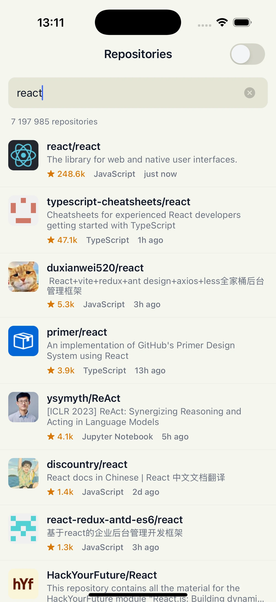
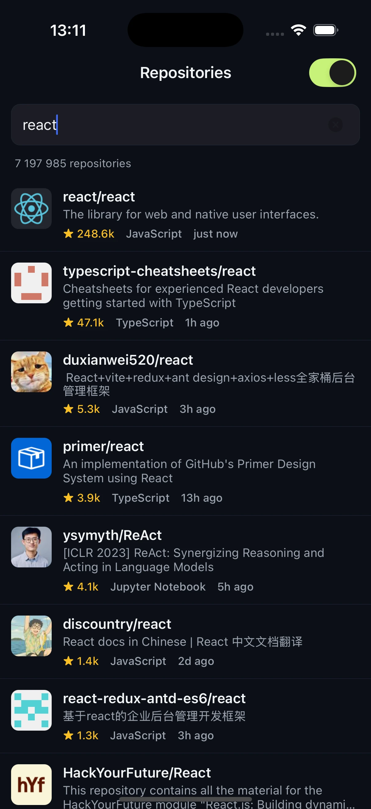
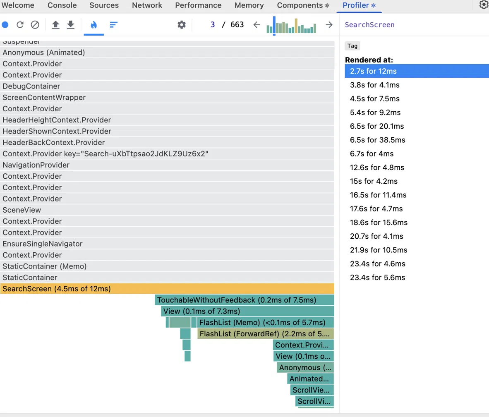

# GitHubExplorer

A cross-platform (iOS/Android) repo search app built with the **React
Native CLI** (bare workflow) + TypeScript strict mode, for the Senior React
Native take-home assignment. Search GitHub by keyword, scroll through
results with infinite scroll, open a repo for its full details — with dark
mode and offline support built in.

<p align="center">
  
  
</p>

## What's implemented

**Core requirements** — all done:

- TypeScript strict mode, no `any` anywhere in the app.
- Search screen, scrollable results (avatar, name, description, stars,
  language, last updated), and a detail screen (owner info, stats, full
  description) — the three screens the assignment asks for.
- GitHub's search endpoint, with one noted deviation (`per_page=30` instead
  of `100` — see below).

**Bonus features** — all three, plus a bit more:

- Infinite scroll, with a visible retry when GitHub's unauthenticated rate
  limit is hit mid-scroll instead of silently going nowhere.
- Dark mode, following the system setting or a manual toggle, persisted
  across restarts.
- Offline support — search results and repo details are cached to disk
  (MMKV) and stay browsable with no network at all.
- Beyond what was asked: i18n-ready strings (`src/services/i18n`), a
  live network-status banner, and cancellation of in-flight requests that
  are no longer needed.

## How to run

```bash
yarn install

# iOS only, once after install and whenever native deps change
cd ios && bundle install && bundle exec pod install && cd ..

yarn start          # Metro bundler, in one terminal
yarn ios            # or: yarn android, in another terminal
```

```bash
yarn typecheck     # tsc --noEmit
yarn test          # jest unit tests
yarn lint          # eslint
yarn android:build  # release APK -> android/app/build/outputs/apk/release/app-release.apk
```

One small change from the assignment's API spec: search requests use
`per_page=30` instead of `per_page=100`. GitHub's Search API still limits
results to 1000 total either way. Smaller pages made the infinite-scroll
logic (and its rate-limit behavior, see below) easier to reason about and
test, without changing what the user can actually reach.

## Key decisions

**Stack**

- **React Native CLI (bare)**, not Expo — this gives full control over
  native dependencies (MMKV/Nitro Modules, FastImage) without going through
  an Expo-managed runtime.
- **TanStack Query (React Query) v5** for all server state — search
  results, pagination, and repo detail. It handles retry/backoff,
  stale-while-revalidate, request de-duplication, and — through
  `@tanstack/react-query-persist-client` — offline persistence. This avoids
  hand-written `useEffect`/`fetch` state machines.
- **Zustand**, only for one piece of state that's purely local UI
  preference with no server side (theme mode). This is deliberately _not_
  routed through React Query. On a bigger app with many such pieces of
  state, I would use Redux Toolkit instead, for shared DevTools and
  stricter action rules.
- **MMKV** (`react-native-mmkv` v4, Nitro Modules) instead of AsyncStorage —
  it is synchronous and has no bridge round-trip. It backs both the React
  Query persister and the theme store, through one shared adapter
  (`src/storage/mmkvStorage.ts`).
- **`@shopify/flash-list` v2** for the results list — it recycles cells
  without needing `estimatedItemSize` (v2 measures automatically). This is
  what keeps the list smooth as it grows with infinite scroll.
- **`@react-navigation/native-stack`** — screen transitions and headers use
  the platform's own navigation controller (`UINavigationController` /
  Fragments), not a JS re-implementation.
- **`@d11/react-native-fast-image`** — disk and memory image caching, plus
  explicit size requests to GitHub's avatar CDN (`?s=<px>`). This means a
  44px list thumbnail never downloads or decodes a full-resolution avatar.
- **i18next / react-i18next** — every text string the user sees lives in
  `src/services/i18n/locales/en.json` from the start, even with only one
  language. So adding a new language later means "translate a JSON file,"
  not "search every screen for text."

**Architecture**

- Feature-based layout: everything specific to repo search lives under
  `src/features/repos/{screens,components,hooks,utils}`. Shared code
  (`src/components`, `src/theme`, `src/services`, `src/storage`) sits next
  to it. Path aliases (`@`, `@components`, `@hooks`, `@theme`, `@utils`)
  keep imports short without hiding the real folder structure.
- `src/api/github.ts` is the only file that knows the shape of GitHub's
  REST API. Screens and hooks never call `fetch` or use the API's field
  names directly — they go through typed hooks (`useRepoSearch`,
  `useRepoDetail`) instead.
- Screen components stay close to pure UI. The data-fetching logic for each
  screen lives in its own hook, so it can be tested on its own, apart from
  the UI.

**Performance-related decisions**

- Avatar requests ask GitHub's CDN for exactly `renderedSize × 2`, never
  the full source image, on every avatar on every screen.
- `RepoListItem` uses `memo`, with stable `onPress` / `renderItem` /
  `keyExtractor` (via `useCallback`). This means rows already on screen
  don't re-render while scrolling.
- The search input's raw, per-keystroke text lives inside `RepoSearchBar`
  itself, not in `SearchScreen` — it used to live in the screen, which meant
  every keystroke re-rendered the whole screen (`FlashList` included), just
  to have memoized children bail out again a level down. `RepoSearchBar`
  now debounces internally and only reports the settled value upward, so a
  keystroke re-renders that one small component, not the results list.
  React DevTools Profiler is what surfaced this — worth checking even when
  nothing looks obviously slow.
- The search input is debounced by 400ms, so it doesn't send a request on
  every keystroke — a separate concern from the point above: debouncing
  stops the *fetch*, isolating the state stops the *re-render*.
- React Query's `AbortSignal` is connected to every `fetch` call. If a
  search request is replaced by a newer one (fast typing), or the detail
  screen is closed before its request finishes, that old request is
  actually cancelled instead of finishing uselessly in the background.
- The detail screen shows the already-cached, list-size avatar right away,
  then quietly loads a sharper version in the background. It never waits
  for a new network request before showing its first frame.

## Performance

### iOS — real device, Release build

Measured on a physical iPhone XR (iOS 18.7.9), in **Release configuration**,
using Xcode's own Instruments (`xcrun xctrace record --template "App
Launch"`). This is a real measurement, not an estimate and not a simulator:

| Metric                                             | Value      | Notes                                                                   |
| -------------------------------------------------- | ---------- | ----------------------------------------------------------------------- |
| Cold start, process launch → first frame on screen | **~623ms** | From `xctrace`'s "App Launch" template. Phase-by-phase breakdown below. |

Phase breakdown from that same trace (process creation → app is interactive):

| Phase                                                            | Duration |
| ---------------------------------------------------------------- | -------- |
| Process creation                                                 | 479.8ms  |
| System interface initialization                                  | 112.7ms  |
| Static runtime initialization                                    | 25.6ms   |
| UIKit initialization                                             | 29.4ms   |
| UIKit scene creation                                             | 2.1ms    |
| `didFinishLaunchingWithOptions()` (React Native bridge/app boot) | 36.4ms   |
| Initial frame rendering                                          | 0.8ms    |

Most of the time (479.8ms) is process creation — this is OS-level overhead
(dyld linking the app's native dependencies) before any of our app code
even runs, and it happens on an iPhone XR, 2018 hardware, not a current
device. Everything under our control, from the RN bridge starting up to
the first frame, adds up to roughly 140ms.

**Is 623ms good?** Yes. Published cold-start numbers for React Native apps
on real hardware are commonly in the 500ms–1.5s range; 623ms sits toward
the fast end of that, and on newer hardware than this iPhone XR it would
likely be lower still. The one place left to actually improve it is the
480ms of process creation — mainly by linking fewer/smaller native
dependencies — but that's a small, diminishing-returns gain, not something
worth chasing right now.

I could not get a reliable scroll-jank or CPU/memory number on the device.
Four separate `xctrace record` attempts on the physical device, across
three different templates (`Animation Hitches`, `Allocations`, `Time
Profiler`), all hung well past their own time limit and left a broken
trace file when stopped. The "App Launch" template, by contrast, worked
cleanly both times it was used. With three different templates failing the
same way, this looks like a systemic `xctrace`-CLI issue in this session —
not a one-off, not specific to one template, and not a problem with the
device or the app. It's the one gap left in this README, and the fix is
straightforward: Instruments.app's normal window instead of the command
line, which doesn't share this problem.

### Android — emulator, debug build

I did not have an Android device available for this round. The numbers
below come from an **Android Emulator on an Apple Silicon Mac, debug
build**, using `adb`'s built-in profiling tools (`dumpsys gfxinfo`,
`dumpsys meminfo`, `am start -W`) instead of Flipper. Two honest notes
before the numbers — and the iOS section above is direct proof of the
first one, same codebase, about 3x faster cold start once measured
correctly:

- **Debug builds** run unminified JS with the developer bridge attached. A
  release build is faster and lighter on every number below.
- **The emulator's GPU is software-translated** (OpenGL-ES over Metal),
  which is clearly slower than a real device's GPU. The jank numbers from
  this emulator should not be read as "the app is janky" — they mostly
  come from this translation layer, not from the app's code.

| Metric                                                            | Value                                     | Notes                                                                                                                                                       |
| ----------------------------------------------------------------- | ----------------------------------------- | ----------------------------------------------------------------------------------------------------------------------------------------------------------- |
| Cold start (`am start -W`)                                        | **1831ms** `TotalTime`                    | Debug build, emulator. Compare to iOS's 623ms (release, real device) above — most of that gap comes from the two notes above, not from the platform itself. |
| Memory (`dumpsys meminfo`, after a search + scroll)               | **~280MB PSS**                            | Debug build; includes Hermes debug info and the dev bridge. Release build should use less.                                                                  |
| Scroll jank, first pass through fresh results (`dumpsys gfxinfo`) | 83.65% janky frames, 50th percentile 53ms | This overlaps with live avatar downloads, so it's not a clean re-scroll measurement.                                                                        |
| Scroll jank, warm re-scroll (cached data)                         | Still high on this emulator               | Small sample (only 12 frames), and mostly caused by the GPU translation layer (see the 4950ms outlier in the raw histogram), not by app code.               |

**Honest summary:** the iOS number is real, measured, release-build data
from a real device, and it's a good result. The Android table and the iOS
scroll-jank number are still first attempts, not final answers. What's
left to make this section complete on both platforms: an Android
**release** build measured on real Android hardware, and a short
Instruments.app session on iOS to get the scroll-jank number.

### A one-time render spike, explained

React DevTools Profiler flagged one `SearchScreen` commit at 38.5ms — over
two frame budgets at 60fps — right when the first page of results mounted
into `FlashList`. Before treating that as a problem, I checked every other
commit from the same session (screenshot below): almost all land between
4ms and 20ms, and only this one hit 38.5ms — exactly when the screen
switched from loading to real data for the first time. `FlashList` also
runs a few quick internal passes right after mounting to measure its first
visible cells, which shows up as several small commits clustered right
after it.

That makes the spike a one-time cost of the first mount, not a recurring
issue — every commit after it settles back to around 4ms. No code change
was needed; optimizing a single, explainable spike would have been
premature.



## What would you improve with more time?

In the order I would work on them:

1. **Finish real-device measurement** — the two gaps named in the Honest
   summary above: iOS scroll-jank/CPU/memory numbers (needs an
   Instruments.app session, not the CLI), and the Android table redone on
   real hardware with a release build, not a debug-build emulator.
2. **Add a top-level Error Boundary.** There isn't one anywhere in the app
   right now. If any part of the app throws an error while rendering, the
   whole app would show a blank white screen with no way to recover. This
   is the biggest weak point in the app today.
3. **Real test coverage.** Right now only pure-function unit tests exist
   (`format.test.ts`). I would add tests for `useRepoSearch` and
   `useRepoDetail` with a mocked network layer, plus one end-to-end test
   for the search → detail flow. Correctness currently depends entirely on
   manual testing.
4. **Slow down `NetworkStatusBanner`'s polling.** Right now it checks the
   connection every 8 seconds for as long as the search screen is open,
   even when the app is clearly online and idle. I would switch to
   checking less often once online, and only check often when actually
   offline.
5. **A simple loading placeholder for avatars** (a blurred preview or a
   plain-color skeleton) instead of an empty space that suddenly fills in.
   This would make loading feel smoother.
